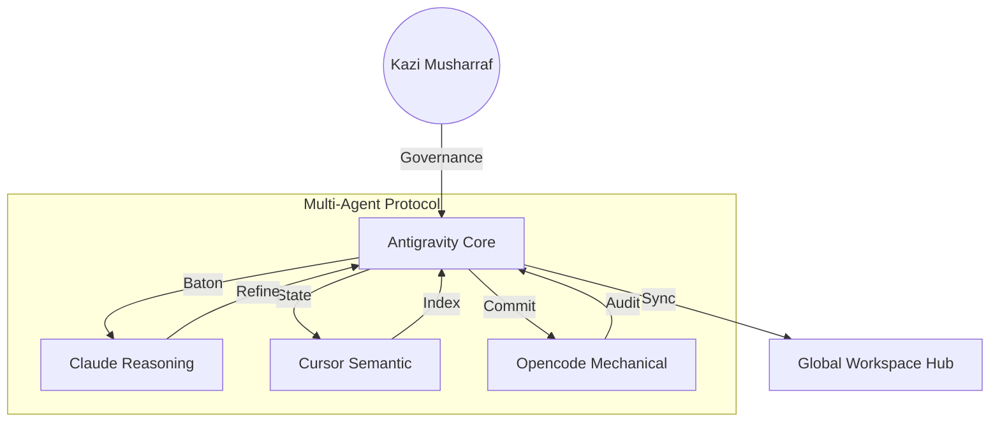

# 🚀 AI-ASSISTANT-ANTIGRAVITY


> **"The agentic development platform for the next decade of software."**

This repository is a production-grade implementation of the **Google Antigravity** ecosystem. It provides the agents, skills, and workflows required to leverage Google's new agent-first development surface, bridging the gap between editor, terminal, and browser.

---

## 🏛️ Orchestration Architecture



---

## 💎 Core Research & Features

According to the Spectrum v4.0 (2026) Technical Manifesto:

| Feature | Category | Description |
| :--- | :--- | :--- |
| **MAP Protocol** | Synchronization | A high-fidelity "Baton Passing" system for inter-agent communication. |
| **Global State Pool** | Context | Shared variables (Tokens, IDs, Routes) across all 6 repositories. |
| **Architect Authority** | Governance | Strict enforcement of Kazi Musharraf's design and logic standards. |
| **Ecosystem Sync** | Automation | Background scripts that ensure 100% architectural parity every 60 seconds. |
| **Audit Gatekeeper** | Security | Final verification layer before any agentic code is finalized. |

---

## 📅 Historical Timeline

- **June 2025**: Antigravity Beta. First successful "Baton Pass" between a reasoning agent and an execution agent.
- **Jan 2026**: **MAP v3.0** Evolution. 500% jump in synchronization speed for multi-repo workspace hubs.
- **Apr 2026**: **Orchestrator Prime**. Massive ecosystem upgrade integrating the "Spectrum Mural" design system.

---

## 🚀 Strategic Workflows

### 1. The "Baton Pass" Protocol
1. **Initiate**: Kazi Musharraf defines a high-level goal (e.g., "Upgrade all Landing Pages").
2. **Reason**: Antigravity assigns **Claude** to research and draft the technical spec.
3. **Execute**: The spec is passed to **Opencode** for bulk implementation.
4. **Finalize**: **Cursor** performs the semantic audit and ensures parity.

### 2. Multi-Repo Synchronization
Achieve zero-drift across the entire workspace.
```bash
# Force a global ecosystem sync
./scripts/sync-all.sh --mode massive --author "Kazi Musharraf"
```

---

## 🛠️ Governance Guardrails

Optimize your Orchestration Core in `antigravity.yaml`:
```yaml
# Spectrum Core Governance
governor:
  name: "Kazi Musharraf"
  role: "Lead Architect"
  policy: "Zero-Drift Execution"

sync:
  frequency: 60s
  target_repos: ["CLAUDE", "CURSOR", "COPILOT", "OPENCODE", "ECOSYSTEM"]
  verification: "Strict-Parity"
```

---

## 📂 Repository Structure

- [**agents/**](file:///Users/mkazi/ALL-REPO/4-AI-ASSISTANT/AI-ASSISTANT-ANTIGRAVITY/agents) — specialized Google-tuned agents for Android, Backend, and AI engineering.
- [**skills/**](file:///Users/mkazi/ALL-REPO/4-AI-ASSISTANT/AI-ASSISTANT-ANTIGRAVITY/skills) — Catalog of reusable agentic skills like "Claw Ecosystem" and "Repo Audit."
- [**workflows/**](file:///Users/mkazi/ALL-REPO/4-AI-ASSISTANT/AI-ASSISTANT-ANTIGRAVITY/workflows) — Detailed patterns for performance, security, and architectural design.
- [**configs/**](file:///Users/mkazi/ALL-REPO/4-AI-ASSISTANT/AI-ASSISTANT-ANTIGRAVITY/configs) — Runtime configurations for the Manager Surface.

---

## 🎯 Strategic Workflows

### 1. The "Manager-Led" Sprint
Use the Manager Surface to orchestrate multiple agents working in parallel. One agent handles the database migration, while another generates the frontend components, and a third writes documentation.
- **Trigger**: "Start a new sprint for Feature X"
- **Result**: Synchronized artifacts across the whole team.

### 2. Multi-Surface Verification
Antigravity agents can move between the editor (code), terminal (execution), and browser (manual verification/UI Audit).
- Describe the visual bug.
- The agent opens the browser, takes a screenshot, and fixes the CSS in the editor.

### 3. Contextual Knowledge Harvesting
As you work, the agents index your decisions and patterns into the project's knowledge base, making the next task 2x faster.

---

## 🛠️ Configuration

Configure your **Manager Surface** in `configs/surface-settings.json`:
```json
{
  "defaultAgent": "Architect",
  "verificationMode": "strict",
  "artifactPersistence": true
}
```

---

## 📜 Resources
- [Google Developer Portal](https://developers.google.com/antigravity)
- [Antigravity Release Notes](docs/FEATURES.md)
- [Multi-Surface API Guide](docs/WORKFLOWS.md)

---
*Maintained by the mk-knight23 collective. Last updated: April 2026.*

---

## Two Surfaces Explained

### 🖊️ Editor View
The traditional, hands-on coding interface:
- **Tab autocomplete** — state-of-the-art inline suggestions
- **Natural language code commands** — type what you want
- **Context-aware agent** — understands your full codebase
- **Configurable agent** — set autonomy level per project
- Synchronous workflow you already know from VS Code

### 🎛️ Manager Surface
The agent-first orchestration interface (the real differentiator):
- **Spawn multiple agents** across different workspaces
- **Observe asynchronously** — agents work while you focus on other things
- **Task-oriented view** — see essential artifacts and verification results
- **Comment on artifacts** like commenting on a Google Doc
- **Agent Manager UI** — central mission control for all running agents

---

## Key Features

### 🤖 Cross-Surface Agents
Agents work simultaneously across:
- **Editor** — modify code, create files
- **Terminal** — run builds, tests, servers
- **Browser** — test UI, verify functionality, take screenshots

```
Example: "Add a share button to the hero component"
→ Agent writes code in editor
→ Runs `npm run dev` in terminal
→ Opens browser, navigates to hero
→ Takes screenshot as Artifact
→ Adjusts CSS until it looks right
→ Reports back with before/after screenshots
```

### 📦 Artifacts System
Agents generate tangible deliverables:
- **Task lists** with checkmarks
- **Implementation plans** with rationale
- **Screenshots** of UI changes
- **Browser recordings** of feature demos
- **Code walkthroughs** with inline annotations

Leave **feedback directly on artifacts** — like commenting on a Google Doc — and the agent incorporates your input without stopping.

### 🔄 Higher-Level Abstractions
More intuitive task monitoring:
- See essential artifacts, not raw tool calls
- Verification results surface automatically
- Build trust progressively

### 🧠 Knowledge Base
Agents learn from your project:
- Save useful code snippets
- Remember architectural decisions
- Improve future task performance
- Shared across all agents in your workspace

### 🌐 Multi-Model Support
Choose the best model for each task:
- **Gemini 3 Pro** — generous rate limits, free for individuals
- **Gemini 3 Flash** — fast, cost-effective
- **Claude Sonnet 4.5** — Anthropic's powerful coding model
- **GPT-OSS** — OpenAI alternative

---

## How I Use It Personally

### Frontend Development Workflow
```
1. Open Antigravity Manager Surface
2. Describe UI task: "Build a responsive dashboard with real-time charts"
3. Agent plans the implementation (Artifact: task list)
4. Agent writes code → runs dev server → opens browser → checks layout
5. I review screenshots, leave feedback on Artifact
6. Agent iterates without restarting
7. Final recording proves feature works end-to-end
```

### Parallel Multi-Agent Work
```
Manager Surface: 3 agents running simultaneously
├── Agent 1: "Fix all TypeScript errors in /src"
├── Agent 2: "Write tests for the auth module"
└── Agent 3: "Optimize bundle size"
```

Each agent reports progress via Artifacts. I review all three without switching context.

---

## Quick Start

### Installation
```bash
# macOS
# Download from: https://antigravity.google/download
# Or via Homebrew:
brew install --cask google-antigravity  # (if available)

# Windows: Download from antigravity.google
# Linux: AppImage or .deb from antigravity.google
```

### First Project
```bash
# 1. Open Antigravity
# 2. Open your project folder
# 3. In Editor View: use tab autocomplete or Cmd+K for inline edits
# 4. In Manager Surface: describe a task and let the agent work
```

### Key Interactions

**Editor View (synchronous):**
- `Tab` — accept autocomplete suggestion
- `Cmd+K` / `Ctrl+K` — natural language inline edit
- `Cmd+L` — open chat sidebar

**Manager Surface (asynchronous):**
- Describe task in natural language
- Watch Artifact feed for progress
- Click artifact to review and leave feedback
- Agent continues without interruption

---

## Artifacts System

Artifacts are the key to trusting Antigravity agents. Instead of scrolling through hundreds of tool call logs, you see:

| Artifact Type | When Generated | What It Shows |
|--------------|----------------|---------------|
| Task List | Task start | Planned steps with checkmarks |
| Implementation Plan | Before coding | Architecture decisions |
| Screenshot | UI change | Before/after visual diff |
| Browser Recording | Feature complete | Full demo video |
| Code Walkthrough | Refactor | Line-by-line annotations |
| Test Results | After testing | Pass/fail summary |

### Leaving Feedback
```
Agent generates screenshot of new login form
You comment: "The button should be green, not blue"
Agent adjusts color → re-screenshots → continues task
```

---

## Workflows

See `workflows/` folder for:
- `frontend-agent.md` — Browser-in-the-loop UI development
- `fullstack-agent.md` — End-to-end feature building
- `enterprise-workflow.md` — Multi-team agent orchestration

---

## Model Support

| Model | Speed | Quality | Cost | Best For |
|-------|-------|---------|------|----------|
| Gemini 3 Pro | Fast | Excellent | Free | Daily work |
| Gemini 3 Flash | Very Fast | Good | Free | Quick edits |
| Claude Sonnet 4.5 | Fast | Excellent | Paid | Complex tasks |
| GPT-OSS | Fast | Good | Paid | Alternatives |

---

## Project Structure

```
AI-ASSISTANT-ANTIGRAVITY/
├── README.md
├── index.html                   # Project website
├── docs/
│   ├── FEATURES.md
│   ├── GETTING_STARTED.md
│   ├── WORKFLOWS.md
│   ├── ARTIFACTS_GUIDE.md
│   └── AGENT_MANAGER.md
├── scripts/
│   ├── setup-antigravity.sh
│   └── agent-workflow.sh
├── workflows/
│   ├── frontend-agent.md
│   ├── fullstack-agent.md
│   └── enterprise-workflow.md
├── examples/
│   └── agent-task-example.md
└── configs/
    └── .gitignore
```

---

## Resources

- [Official Website](https://antigravity.google)
- [Developer Blog](https://developers.googleblog.com/build-with-google-antigravity-our-new-agentic-development-platform/)
- [Download](https://antigravity.google/download)
- [Blog: Gemini 3.1 Pro in Antigravity](https://antigravity.google/blog)

---

*Google Antigravity — experience liftoff. Built in 2026 by mk-knight23.*

## Security

This project follows security best practices:
- No hardcoded credentials
- Dependency scanning enabled
- Security headers configured
- Regular security audits performed
